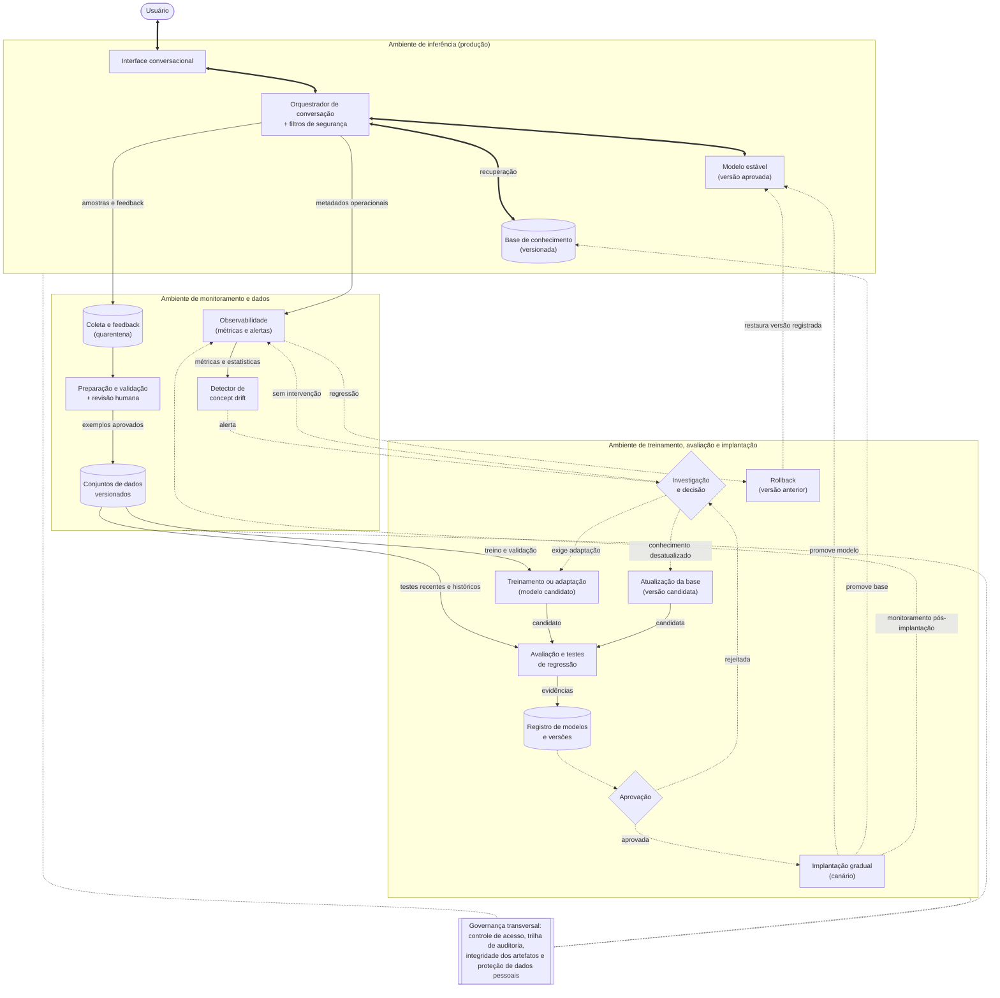

# Aprendizado contínuo controlado em sistemas conversacionais: uma arquitetura para lidar com *concept drift*, atualizar conhecimento e preservar capacidades

- **Autor:** Celso Rodrigues Rocha Júnior
- **Curso:** Engenharia de Software — Módulo 07
- **Disciplina:** Tópicos Avançados em Processamento de Linguagem Natural
- **Professor:** Bryan Kano Ferreira
- **Atividade:** Autoestudo 3 — Tópicos Avançados (Segurança ou MLOps), Alternativa 1: aprendizado contínuo

## Resumo

Sistemas conversacionais baseados em Processamento de Linguagem Natural (PLN) são treinados com dados de um período e passam a operar em ambientes que mudam: surgem novos assuntos, os usuários mudam a forma de se expressar, regras de negócio são revistas e fatos deixam de ser verdadeiros. Este trabalho propõe uma arquitetura conceitual de aprendizado contínuo controlado para esse tipo de sistema. A proposta isola o modelo estável, que atende os usuários, de um ciclo de adaptação que observa a produção, trata alertas de *concept drift* como hipóteses a investigar, escolhe a menor intervenção suficiente — nenhuma ação, atualização da base de conhecimento ou adaptação de parâmetros — e só promove uma versão candidata depois de compará-la com a versão vigente em dados recentes, históricos e de segurança. A avaliação incorpora testes de retenção inspirados no problema de *Continual Knowledge Learning*, para conter o esquecimento catastrófico, e a camada de dados trata as interações coletadas como entradas não confiáveis, com quarentena, validação, revisão humana e rastreabilidade, para reduzir os riscos de envenenamento e de exposição de dados pessoais. Por fim, o trabalho discute o esforço de implementação em fases e os compromissos entre adaptação, custo, qualidade e risco.

**Palavras-chave:** aprendizado contínuo; *concept drift*; esquecimento catastrófico; sistemas conversacionais; MLOps; segurança de modelos de linguagem.

## Sumário

- [1 Introdução](#1-introdução)
  - [1.1 Sistemas conversacionais em ambientes que mudam](#11-sistemas-conversacionais-em-ambientes-que-mudam)
  - [1.2 Concept drift e desatualização do conhecimento](#12-concept-drift-e-desatualização-do-conhecimento)
  - [1.3 Aprendizado contínuo e esquecimento catastrófico](#13-aprendizado-contínuo-e-esquecimento-catastrófico)
  - [1.4 A atualização como superfície de ataque](#14-a-atualização-como-superfície-de-ataque)
  - [1.5 Objetivo e justificativa da proposta](#15-objetivo-e-justificativa-da-proposta)
- [2 Solução proposta](#2-solução-proposta)
  - [2.1 Visão geral e princípios de projeto](#21-visão-geral-e-princípios-de-projeto)
  - [2.2 Diagrama de arquitetura](#22-diagrama-de-arquitetura)
  - [2.3 Responsabilidades dos módulos](#23-responsabilidades-dos-módulos)
  - [2.4 Ciclo operacional de atualização](#24-ciclo-operacional-de-atualização)
  - [2.5 Avaliação e controle de qualidade](#25-avaliação-e-controle-de-qualidade)
  - [2.6 Segurança, privacidade e governança](#26-segurança-privacidade-e-governança)
  - [2.7 Viabilidade e esforço de implementação](#27-viabilidade-e-esforço-de-implementação)
- [3 Conclusão](#3-conclusão)
- [Referências](#referências)

## 1 Introdução

### 1.1 Sistemas conversacionais em ambientes que mudam

Assistentes virtuais, *chatbots* de atendimento e sistemas de perguntas e respostas estão entre as aplicações mais visíveis do PLN. Por trás da conversa, esses sistemas combinam modelos probabilísticos: um classificador estima a probabilidade de cada intenção dado o enunciado do usuário, um modelo de linguagem estima a probabilidade da próxima palavra dado o contexto e um mecanismo de recuperação ordena documentos pela relevância estimada. Todos são ajustados a partir de uma amostra de dados de um período e carregam a premissa implícita de que a distribuição encontrada em produção continuará parecida com a do treinamento.

Essa premissa é frágil. Liu e Mazumder (2021) apontam que os *chatbots* costumam ser treinados com dados rotulados manualmente ou com regras escritas à mão e dependem de bases de conhecimento compiladas por especialistas, que permanecem fixas depois da implantação; como nenhum conjunto de treinamento cobre todas as variações da linguagem, um sistema bem treinado frequentemente tem desempenho ruim quando entra em uso. Nos modelos de linguagem de grande porte, a limitação atinge também o conhecimento de mundo armazenado nos parâmetros. Jang *et al.* (2022) mostram que esse conhecimento pode ficar desatualizado rapidamente: o T5, pré-treinado com um recorte da web de abril de 2019, não tem como saber quem venceu a eleição presidencial norte-americana de 2020, e respostas que eram corretas, como o clube em que determinado jogador atua, deixam de ser.

### 1.2 Concept drift e desatualização do conhecimento

Lu *et al.* (2019) definem *concept drift* como uma mudança imprevista, ao longo do tempo, nas propriedades estatísticas do domínio que o modelo procura aprender. Formalmente, há *drift* no instante t + 1 quando a distribuição conjunta das entradas X e das saídas y deixa de ser a mesma; como essa distribuição se decompõe no produto entre a distribuição das entradas e a das saídas condicionada às entradas,

```math
P_t(X, y) \neq P_{t+1}(X, y), \qquad P_t(X, y) = P_t(X)\,P_t(y \mid X)
```

a mudança pode ter três origens: apenas P(X) muda, situação que os autores chamam de *drift* virtual, porque a fronteira de decisão não se altera; muda P(y | X), o *drift* real, que desloca a fronteira de decisão e reduz a acurácia; ou as duas mudam ao mesmo tempo. Quanto à dinâmica, a mudança pode ser súbita, gradual, incremental ou recorrente (Lu *et al.*, 2019).

Em um sistema conversacional, essas categorias têm correspondentes concretos. O lançamento de um produto, uma campanha sazonal ou a abertura de um canal de voz mudam o que os usuários perguntam e como perguntam, o que é uma mudança em P(X). A revisão de uma política comercial pode fazer com que a mesma pergunta — por exemplo, se é possível cancelar um serviço sem multa — passe a exigir outra resposta ou outro encaminhamento, o que é uma mudança em P(y | X). Um modelo cujos parâmetros permanecem inalterados não se degrada por conta própria: o desempenho cai quando o ambiente se afasta das condições representadas no treinamento, seja porque chegam novos usuários e canais, seja porque mudam os produtos, as regras ou a própria linguagem. Em domínios estáveis, essa distância pode permanecer pequena por muito tempo; por isso, a ocorrência de *drift* deve ser medida, e não presumida.

Nem toda desatualização de conhecimento, porém, é *concept drift*. Jang *et al.* (2022) distinguem três tipos de conhecimento em um modelo de linguagem: o invariante no tempo, que deve ser preservado; o desatualizado, que entra em conflito com informações mais recentes e precisa ser atualizado; e o novo, ausente do corpus original, que precisa ser adquirido. Quando o horário de funcionamento de uma loja muda, as perguntas sobre horário continuam estatisticamente idênticas e continuam pertencendo à mesma intenção; o que deixou de valer é o fato usado para compor a resposta. Se a saída for definida como a própria resposta, a situação pode ser descrita formalmente como uma mudança em P(y | X), mas ela não deixa rastro nas entradas e só aparece quando alguém confronta a resposta com a realidade. Em termos de geração de linguagem natural, o problema está na determinação do conteúdo, a etapa que decide quais informações o texto deve comunicar (Reiter; Dale, 1997): a resposta pode ser fluente e, ainda assim, transmitir um fato obsoleto. Esse tipo de falha pode não aparecer em detectores que observam apenas as entradas. No sentido inverso, uma mudança em P(X) pode ser inofensiva: Rabanser, Günnemann e Lipton (2019) observam que, na prática, as distribuições mudam constantemente e que muitas dessas mudanças têm impacto desprezível no desempenho. Detectar uma mudança, portanto, não equivale a confirmar perda de qualidade.

### 1.3 Aprendizado contínuo e esquecimento catastrófico

Retreinar todo o sistema a cada mudança é caro. Madotto *et al.* (2021) justificam o aprendizado contínuo em sistemas de diálogo orientados a tarefas justamente pela possibilidade de acrescentar domínios e funcionalidades depois da implantação sem o custo de retreinar o sistema inteiro, e Jang *et al.* (2022) observam que repetir o pré-treinamento com um corpus atualizado de escala semelhante à original é computacionalmente custoso. O aprendizado contínuo propõe aprender a partir de uma sequência de dados ou tarefas, aproveitando o que já foi aprendido. Liu e Mazumder (2021) estendem a ideia ao aprendizado em serviço (*on-the-job learning*): depois de implantado, o sistema descobre o que não sabe, obtém dados de referência por meio da interação com os usuários e aprende de forma incremental.

O principal obstáculo é o esquecimento catastrófico: redes neurais treinadas sequencialmente tendem a perder o desempenho em tarefas aprendidas antes, porque os mesmos parâmetros passam a ser ajustados para os dados novos (Kirkpatrick *et al.*, 2017). Em modelos de linguagem, o efeito é mensurável. No experimento principal de Jang *et al.* (2022, p. 7), continuar o pré-treinamento do T5 com notícias recentes, sem nenhuma estratégia de mitigação, elevou o acerto exato em fatos atualizados de 1,62 para 10,17, mas reduziu o acerto em conhecimento invariante de 24,17 para 12,89 — quase metade do que o modelo sabia. Em diálogo orientado a tarefas, Madotto *et al.* (2021) chegaram a uma conclusão compatível: métodos baseados em regularização não evitaram o esquecimento ao longo de 37 domínios, e nenhum método contínuo alcançou o desempenho do treinamento conjunto com todos os dados. Atualizar um sistema conversacional é, portanto, um problema de compromisso entre se adaptar ao que mudou e preservar o que continua válido.

### 1.4 A atualização como superfície de ataque

Aprender com as interações abre um canal pelo qual os usuários influenciam o comportamento futuro do sistema. Liu e Mazumder (2021) reconhecem que o conhecimento obtido de usuários pode estar errado, por engano ou de propósito, já que alguns usuários podem tentar enganar o sistema deliberadamente. Wan *et al.* (2023) mostram que conjuntos de ajuste por instruções que incorporam exemplos enviados por usuários podem ser envenenados: com apenas cem exemplos manipulados, foi possível associar frases-gatilho a comportamentos indesejados em diversas tarefas, sem prejudicar a acurácia em entradas normais. Mesmo sem intenção maliciosa, o ajuste fino com dados benignos pode degradar o alinhamento de segurança de um modelo (Qi *et al.*, 2024). Na inferência, Zou *et al.* (2023) demonstram que sufixos adversariais gerados automaticamente induzem modelos alinhados a produzir conteúdo nocivo e se transferem para *chatbots* comerciais, o que torna provável que os registros de um sistema exposto ao público contenham tentativas de ataque. O National Institute of Standards and Technology (NIST, 2023, p. 38) resume o problema ao observar que sistemas de IA podem exigir manutenção mais frequente por causa de *drift* de dados, de modelo ou de conceito, e que mudanças intencionais ou não intencionais durante o treinamento podem alterar fundamentalmente seu desempenho.

### 1.5 Objetivo e justificativa da proposta

Este trabalho propõe uma arquitetura conceitual de aprendizado contínuo controlado para um sistema conversacional construído sobre um modelo de linguagem pré-treinado, com ou sem recuperação de documentos. O problema específico que ela procura resolver é manter a qualidade do sistema em um ambiente que muda sem permitir que o próprio processo de atualização introduza esquecimento, comportamento inseguro, dados envenenados ou exposição de informações pessoais. A justificativa está no que as seções anteriores mostram: adaptar sem controle troca um problema (a desatualização) por outros (o esquecimento e a manipulação), enquanto não adaptar deixa o sistema envelhecer. Por isso, a arquitetura separa o modelo em produção do processo de adaptação, trata alertas como hipóteses, prefere a menor intervenção suficiente e só implanta versões comparadas com a vigente, rastreáveis e reversíveis, segundo os princípios detalhados na [seção 2.1](#21-visão-geral-e-princípios-de-projeto). Trata-se de uma proposta arquitetural fundamentada, e não da implementação de um sistema.

## 2 Solução proposta

### 2.1 Visão geral e princípios de projeto

A arquitetura organiza o sistema em três ambientes, com responsabilidades e permissões distintas, e em uma camada de governança que os atravessa. O ambiente de inferência atende os usuários com uma versão aprovada; o ambiente de monitoramento e dados observa a produção e transforma interações em evidências e conjuntos de dados; o ambiente de treinamento, avaliação e implantação produz, testa e promove versões candidatas. A divisão segue a visão de MLOps de Kreuzberger, Kühl e Hirschl (2023), para quem o treinamento contínuo depende de um componente de monitoramento, de um laço de realimentação e de uma etapa de avaliação que sempre acompanha o retreinamento, e exige o versionamento de dados, modelos e código para garantir reprodutibilidade e rastreabilidade.

Cinco princípios orientam as decisões de projeto:

1. **Isolamento do modelo estável.** Nenhuma mensagem, avaliação ou correção altera diretamente os parâmetros do modelo em produção; mudanças só chegam aos usuários como versões registradas e aprovadas. A proposta aproveita a ideia de aprender com as interações, defendida por Liu e Mazumder (2021), mas abre mão da atualização durante a própria conversa em troca de controle.
2. **Alerta não é ordem de retreinamento.** A detecção de uma mudança inicia uma investigação, coerente com a separação entre detecção, compreensão e adaptação do *drift* proposta por Lu *et al.* (2019).
3. **Menor intervenção suficiente.** Quando o problema é um fato desatualizado, atualizar a base de conhecimento pode bastar; a adaptação de parâmetros fica reservada às mudanças que a base não resolve.
4. **Adaptação condicionada à retenção.** Toda candidata é comparada com a versão vigente e precisa demonstrar que preserva capacidades anteriores, inclusive as de segurança.
5. **Dados como superfície de ataque.** Interações coletadas são entradas não confiáveis até serem validadas, e todo artefato que influencia o comportamento do sistema é versionado, protegido e auditável.

### 2.2 Diagrama de arquitetura

A Figura 1 apresenta os blocos da arquitetura e os fluxos entre eles. Setas espessas indicam o caminho de inferência, percorrido a cada mensagem; setas contínuas indicam fluxos de dados; setas tracejadas indicam fluxos de controle e decisão; e linhas tracejadas sem ponta ligam a governança aos três ambientes.

**Figura 1 — Arquitetura de aprendizado contínuo controlado para um sistema conversacional**



Fonte: elaborado pelo autor.

No caminho normal, a mensagem do usuário passa pela interface e pelo orquestrador, que consulta a base de conhecimento quando necessário e obtém a resposta do modelo estável. Esse caminho não contém nenhuma etapa de aprendizado. Em paralelo, o orquestrador envia metadados operacionais à observabilidade e encaminha amostras selecionadas, com o feedback dos usuários, para a área de quarentena. Os dados em quarentena só alcançam os conjuntos versionados depois de passarem pela preparação, pela validação e, quando necessário, pela revisão humana.

O caminho de atualização começa quando o detector de *concept drift*, alimentado por métricas e estatísticas, emite um alerta. A investigação pode concluir que não há nada a fazer, que basta preparar uma nova versão da base de conhecimento ou que é preciso adaptar o modelo. Nos dois últimos casos, a candidata é avaliada com testes recentes e históricos, suas evidências são registradas e a aprovação decide entre rejeitá-la, devolvendo o caso à investigação, ou liberá-la para implantação gradual. Depois da promoção, a nova versão é monitorada com atenção reforçada, e uma regressão aciona o *rollback* para a versão registrada anterior.

### 2.3 Responsabilidades dos módulos

Os módulos são descritos por ambiente. Para cada um, indicam-se a responsabilidade, os dados que recebe, o que produz, a contribuição para o aprendizado contínuo e os cuidados de segurança, qualidade ou confiabilidade pertinentes. O Quadro 1, ao final da seção, resume as entradas e saídas.

#### 2.3.1 Ambiente de inferência

**Interface conversacional.** Recebe as mensagens do usuário, mantém a sessão no canal, seja texto ou voz, e apresenta as respostas. Encaminha ao orquestrador o conteúdo da mensagem e o contexto da sessão. Sua contribuição para o aprendizado contínuo é captar sinais explícitos de qualidade — avaliação da resposta, correções, pedidos de atendimento humano — de forma pouco intrusiva, e informar ao usuário se e para que suas interações poderão ser usadas, em atenção ao princípio da finalidade da Lei Geral de Proteção de Dados Pessoais (LGPD), que exige propósitos legítimos, específicos, explícitos e informados ao titular (Brasil, 2018, art. 6º, I). Por ser o ponto de entrada, também aplica autenticação e limites de taxa compatíveis com o canal.

**Orquestrador de conversação.** Mantém o estado do diálogo, monta o contexto enviado ao modelo, consulta a base de conhecimento, aplica filtros de entrada e de saída e decide quando recorrer ao *fallback* ou ao atendimento humano. Recebe as mensagens da interface e devolve as respostas; envia à observabilidade apenas metadados operacionais — versão usada, latência, intenção prevista e confiança, acionamento de *fallback*, resultado dos filtros — e encaminha à coleta somente amostras selecionadas por regras explícitas, como conversas com avaliação negativa, baixa confiança ou *fallback*, além de uma pequena fração aleatória. A fração aleatória existe porque um modelo pode influenciar a seleção de seus próprios dados de treinamento futuros; Sculley *et al.* (2015) sugerem usar alguma aleatorização ou isolar parte dos dados dessa influência para atenuar o laço de realimentação. Os filtros são a primeira linha de defesa contra ataques em tempo de inferência: separar as instruções do sistema do conteúdo do usuário, detectar e encerrar interações nocivas e registrar tentativas de ataque para resposta posterior são intervenções descritas por Vassilev *et al.* (2025, p. 48-49), que também advertem que esses detectores podem ser atacados e falhar junto com o modelo que monitoram.

**Modelo conversacional em produção.** É a versão estável que gera as respostas e, conforme o projeto, classifica intenções. É carregado a partir do registro de modelos, recebe do orquestrador o contexto montado e devolve a resposta. No ambiente de inferência, seus parâmetros são somente leitura: nenhuma interação altera os pesos em tempo real. Esse isolamento impede que um conjunto coordenado de interações, como os exemplos envenenados estudados por Wan *et al.* (2023), reprograme o sistema sem passar pelos controles, e permite reproduzir com exatidão o comportamento de cada versão durante uma investigação. A confidencialidade dos pesos também importa: Vassilev *et al.* (2025, p. 44) observam que o acesso de caixa-branca a modelos de pesos abertos torna viável construir ataques transferíveis como os de Zou *et al.* (2023), o que sugere que o vazamento dos pesos adaptados facilitaria ataques dirigidos à versão em produção.

**Base de conhecimento.** Armazena documentos, fatos e regras de negócio que o orquestrador recupera para compor as respostas, isto é, a matéria-prima da determinação do conteúdo. Por ser uma memória não paramétrica, pode ser atualizada sem alterar o modelo. Lewis *et al.* (2020) demonstraram isso trocando o índice de documentos de um modelo de geração aumentada por recuperação: com o índice de 2016, o modelo respondeu corretamente 70% das perguntas sobre líderes mundiais daquele ano; com o de 2018, 68% das perguntas sobre os líderes de 2018; com os índices trocados, os acertos caíram para 12% e 4%. A base é versionada como qualquer artefato implantável e só recebe atualizações pelo ciclo de adaptação, porque uma atualização pode inserir fatos errados ou instruções maliciosas que o modelo lerá como contexto. Vassilev *et al.* (2025, p. 41) identificam a possibilidade de modificar documentos e páginas consumidos pelo modelo em tempo de execução como a capacidade explorada nas injeções indiretas de *prompt*.

#### 2.3.2 Ambiente de monitoramento e dados

**Camada de observabilidade.** Agrega métricas operacionais e de qualidade por versão, canal e categoria de solicitação: latência, taxa de erros, taxa de *fallback*, transferências para atendimento humano, distribuição das intenções previstas e de suas confianças, avaliações dos usuários e resultados dos filtros de segurança. Recebe os metadados do orquestrador e produz séries temporais e alertas operacionais. A segmentação por categoria é essencial, pois uma piora concentrada em uma intenção pode desaparecer na média. Sculley *et al.* (2015) recomendam fatiar indicadores como o viés de predição — a diferença entre a distribuição dos rótulos previstos e a dos observados — para isolar problemas e gerar alertas automáticos, inclusive quando o comportamento do mundo muda e os dados históricos deixam de refletir a realidade. A camada atende à subcategoria MEASURE 2.4 do *AI Risk Management Framework* (AI RMF), segundo a qual a funcionalidade e o comportamento do sistema e de seus componentes devem ser monitorados em produção (NIST, 2023, p. 29); ela alimenta o detector de *drift* e, depois de uma implantação, sustenta a decisão de *rollback*.

**Coleta e feedback em quarentena.** Recebe as amostras selecionadas e os sinais de feedback e os mantém em uma zona de quarentena, separada dos dados aprovados para treinamento. A ideia corresponde ao armazenamento de conhecimento não verificado (*unverified knowledge buffer*) proposto por Liu e Mazumder (2021, p. 15062), no qual um exemplo obtido de usuários só é considerado confiável depois de confirmado por vários usuários diferentes. Nesta proposta, a quarentena também aplica minimização: guarda apenas os campos necessários para a finalidade declarada, pseudonimiza identificadores na entrada e tem prazo de retenção definido, após o qual os dados não aprovados são eliminados, em atenção aos princípios da finalidade e da necessidade e às regras de término do tratamento da LGPD (Brasil, 2018, arts. 6º, 15 e 16). Cada registro guarda metadados de proveniência — canal, versão que gerou a resposta, data e um identificador pseudonimizado da origem —, o que permite limitar a influência de uma única fonte e investigar padrões coordenados.

**Pipeline de preparação e validação.** Transforma registros em quarentena em exemplos candidatos e decide quais podem seguir. As etapas incluem remoção ou mascaramento de dados pessoais e confidenciais, deduplicação exata e aproximada, verificação de formato e idioma, checagem de consistência entre rótulos, detecção de anomalias e de padrões de repetição por origem e, para exemplos factuais, conferência com fontes oficiais. A deduplicação tem dupla função: evita que poucos usuários ou mensagens repetidas dominem o conjunto e reduz a exposição repetida aos mesmos dados, que Jang *et al.* (2022, p. 9) identificaram como causa crítica de esquecimento. Contra envenenamento, Wan *et al.* (2023) relatam que sinalizar amostras de perda elevada remove muitos exemplos envenenados a um custo moderado no tamanho do conjunto, e a tarefa PW.3.1 do perfil do *Secure Software Development Framework* (SSDF) para IA generativa recomenda analisar os dados em busca de sinais de envenenamento, viés, homogeneidade e adulteração antes do uso, verificando proveniência e integridade e considerando a participação humana na análise (Booth *et al.*, 2024, p. 14-15). A revisão humana é obrigatória para exemplos ambíguos, sensíveis, de alto impacto ou sinalizados pelos filtros. Exemplos com tentativas de ataque confirmadas nunca entram no conjunto de adaptação como demonstração do comportamento desejado; quando úteis, seguem, identificados como tal, para a suíte de testes de segurança.

**Detector de concept drift.** Compara janelas recentes com uma janela de referência e emite alertas quando a diferença é estatisticamente significativa. Lu *et al.* (2019) descrevem esse processo em quatro etapas — recuperação dos dados, modelagem opcional, cálculo de uma estatística de dissimilaridade e teste de hipótese — e observam que, sem o teste de hipótese, não é possível distinguir *drift* de ruído ou de viés amostral. O detector acompanha três famílias de sinais:

- **Sinais de entrada**, que indicam mudança em P(X): distribuição das representações vetoriais dos enunciados, vocabulário desconhecido, comprimento das mensagens, canais e horários de uso.
- **Sinais de saída do modelo**, que não exigem rótulos: distribuição das intenções previstas e das confianças e taxa de *fallback*. Em experimentos com dados de imagem, Rabanser, Günnemann e Lipton (2019) obtiveram os melhores resultados de detecção usando as saídas *softmax* de um classificador como redução de dimensionalidade, seguidas de testes de duas amostras; aplicar a mesma estratégia às intenções de um assistente é uma extrapolação desta proposta, que precisa ser validada.
- **Sinais de desempenho**, que dependem de rótulos ou de feedback: taxa de resolução, avaliações negativas, correções e erros confirmados em amostras rotuladas.

Os dois primeiros grupos indicam que algo mudou, mas não confirmam perda de qualidade, e o terceiro chega com atraso. Lu *et al.* (2019) notam que a maioria dos métodos de detecção supõe que o rótulo verdadeiro estará disponível após a predição, o que raramente acontece em conversas abertas. Por isso, cada alerta é emitido com os exemplos que mais caracterizam a mudança, e a investigação submete uma amostra deles à rotulagem humana, estratégia sugerida por Rabanser, Günnemann e Lipton (2019) para estimar se a mudança é maligna, isto é, se prejudica o desempenho.

**Gerenciador de conjuntos de dados.** Mantém versões imutáveis dos conjuntos de treinamento, validação e teste, com a linhagem de cada exemplo: origem, transformações aplicadas, revisor e data de aprovação. Além dos dados recentes aprovados, preserva três acervos que não podem ser descartados: o conjunto histórico de retenção, com casos que devem continuar sendo resolvidos como antes; o conjunto de conhecimento atualizado, com casos cuja resposta correta mudou; e a suíte de segurança, com tentativas de ataque, pedidos que devem ser recusados e testes de vazamento de dados. Essa organização espelha as categorias de Jang *et al.* (2022) e permite medir separadamente retenção, atualização e aquisição. O gerenciador também atende pedidos de eliminação ou retificação de dados e registra essas mudanças, como sugere a ação MG-4.1-006 do perfil de IA generativa do NIST, que trata do rastreamento de modificações nos conjuntos de dados para fins de proveniência (NIST, 2024, p. 44).

#### 2.3.3 Ambiente de treinamento, avaliação e implantação

**Investigação e decisão.** Transforma um alerta em uma decisão documentada. A investigação reúne o tipo de sinal, a extensão e a duração da mudança, as categorias afetadas, os exemplos característicos e o resultado da rotulagem de uma amostra, e responde a três perguntas: a mudança é real ou ruído? Ela afeta a qualidade? Qual é a menor intervenção capaz de corrigi-la? O [Quadro 2](#24-ciclo-operacional-de-atualização) resume as situações típicas. O módulo é deliberadamente conduzido por pessoas, pois a mesma evidência estatística pode ter causas muito diferentes — inclusive um ataque coordenado — e cada causa pede uma resposta diferente.

**Atualização da base de conhecimento.** Quando a investigação conclui que o problema é conteúdo desatualizado ou ausente, prepara-se uma nova versão da base: documentos são incluídos, corrigidos ou retirados a partir de fontes oficiais, passam pela mesma validação aplicada aos exemplos, inclusive a busca por instruções embutidas, e formam uma versão candidata que segue para a avaliação como qualquer outra mudança. Em geral, essa é a intervenção mais barata e mais fácil de reverter.

**Treinamento ou adaptação.** Produz um modelo candidato a partir de uma versão congelada dos dados aprovados, de uma configuração versionada e do modelo-base registrado. A técnica depende da mudança e do acesso ao modelo. Jang *et al.* (2022) verificaram que os métodos de expansão de parâmetros, que congelam o modelo original e treinam parâmetros adicionais, como LoRA e K-Adapter, apresentaram o melhor equilíbrio entre esquecer pouco e aprender o novo, ao passo que o ensaio com dados antigos (*rehearsal*) teve o pior desempenho na atualização de conhecimento. Em diálogo orientado a tarefas, porém, Madotto *et al.* (2021) observaram que o *replay* de exemplos anteriores e os adaptadores residuais tiveram desempenho comparável no reconhecimento de intenções e no rastreamento do estado do diálogo, com o *replay* sendo o melhor para geração de linguagem natural. Não há técnica universalmente adequada, e todas têm custo: os mesmos autores concluem que não existe almoço grátis, já que a memória de exemplos do *replay* e os parâmetros dos adaptadores crescem linearmente com o número de tarefas, e Jang *et al.* (2022, p. 9) mostram que métodos de expansão acrescentam parâmetros a cada fase de atualização.

Por isso, a arquitetura recomenda começar por adaptadores de baixo posto, como os da técnica LoRA (Hu *et al.*, 2021), treinados sobre um modelo-base congelado. Essa escolha preserva o modelo original, reduz o custo de treinamento — Hu *et al.* (2021) relatam redução de 10.000 vezes no número de parâmetros treináveis e de três vezes na memória de GPU em relação ao ajuste fino completo do GPT-3 175B — e torna simples a reversão de parâmetros. Quando a mudança for de domínio ou de tarefa, o *replay* de exemplos históricos é uma alternativa a avaliar. Periodicamente, os adaptadores acumulados podem ser consolidados em um novo modelo-base, o que exige um ciclo completo de avaliação. O pipeline usa poucas épocas e taxa de aprendizado conservadora: Jang *et al.* (2022) relacionam a repetição dos mesmos dados ao esquecimento e indicam que a taxa de aprendizado regula o equilíbrio entre esquecer e aprender, e Wan *et al.* (2023) relatam que reduzir épocas, taxa de aprendizado ou número de parâmetros atenua o efeito do envenenamento, ainda que com algum custo de acurácia.

**Avaliação e testes de regressão.** Executa, para a candidata e para a versão vigente, a mesma bateria de testes recentes, históricos, de conhecimento atualizado, de segurança e operacionais, e produz um relatório comparativo que segue para o registro. Conjuntos, métricas e critérios estão detalhados na [seção 2.5](#25-avaliação-e-controle-de-qualidade).

**Registro e versionamento.** Armazena cada versão — modelo-base, adaptadores, configuração, instruções de sistema e versão da base de conhecimento — com seus metadados: versão dos dados usados, código e parâmetros de treinamento, resultados de avaliação, decisão de aprovação e responsáveis. Kreuzberger, Kühl e Hirschl (2023) descrevem esse papel como o de um registro de modelos combinado a um repositório de metadados que guarda a linhagem de dados e código de cada execução. O registro é a única origem de artefatos implantáveis; os artefatos são assinados e têm o *hash* verificado antes da implantação, em linha com as tarefas PS.1.3 e PS.2.1 do perfil SSDF para IA generativa, que recomendam proteger pesos e parâmetros contra acesso e modificação não autorizados e fornecer *hashes* ou assinaturas digitais para o modelo e para suas mudanças (Booth *et al.*, 2024, p. 12). A tarefa PS.3.2 complementa esse controle ao recomendar o rastreamento da proveniência do modelo e a identificação dos modelos treinados com dados sensíveis (Booth *et al.*, 2024, p. 13).

**Aprovação, implantação controlada e rollback.** A aprovação combina critérios objetivos, definidos antes da avaliação, com a assinatura de um responsável que não tenha produzido a candidata, o que separa funções e dificulta que uma única pessoa ou credencial promova uma versão comprometida. A subcategoria MANAGE 1.1 do AI RMF prevê essa decisão sobre se o desenvolvimento ou a implantação deve prosseguir (NIST, 2023, p. 32). Aprovada, a versão entra em implantação gradual: quando possível, primeiro em modo sombra, com respostas geradas apenas para comparação; depois para uma pequena fração do tráfego (canário), com ampliação progressiva enquanto os indicadores permanecerem dentro dos limites. O *rollback* restaura a versão anterior registrada — o que, com adaptadores, pode significar apenas desativá-los — e pode ser acionado automaticamente por limites operacionais ou manualmente após um incidente. Esses mecanismos atendem à subcategoria MANAGE 2.4, que pede meios para substituir, desligar ou desativar sistemas cujo desempenho seja inconsistente com o uso pretendido (NIST, 2023, p. 32).

**Ciclo de monitoramento pós-implantação.** Depois da promoção, a observabilidade compara a nova versão com a anterior nos mesmos recortes, com atenção reforçada por um período definido. O que se aprende nesse período — regressões, novos padrões de erro, incidentes — volta para os conjuntos de teste e para os critérios de aprovação, o que fecha o ciclo de melhoria contínua. Essa realimentação corresponde à subcategoria MANAGE 4.1 do AI RMF, que pede planos de monitoramento pós-implantação com mecanismos para captar a avaliação dos usuários, responder a incidentes, recuperar o sistema e gerir mudanças (NIST, 2023, p. 33).

#### 2.3.4 Governança transversal

A governança não é uma etapa do fluxo, e sim um conjunto de controles aplicado aos três ambientes: controle de acesso com privilégio mínimo e segregação de funções, trilha de auditoria imutável das alterações em dados, código, configurações e versões, proteção de dados pessoais e resposta a incidentes. Seu papel é garantir que cada mudança no comportamento do sistema tenha origem conhecida, autorização registrada e caminho de reversão. Esses controles são detalhados na [seção 2.6](#26-segurança-privacidade-e-governança).

**Quadro 1 — Entradas e saídas dos módulos**

| Módulo | Recebe | Produz ou encaminha |
|---|---|---|
| Interface conversacional | Mensagens e avaliações do usuário | Mensagem e contexto da sessão para o orquestrador; resposta ao usuário |
| Orquestrador de conversação | Mensagem, contexto, trechos da base, resposta do modelo | Resposta filtrada; metadados para a observabilidade; amostras e feedback para a coleta |
| Modelo em produção | Contexto montado pelo orquestrador | Resposta e, se aplicável, intenção prevista e confiança |
| Base de conhecimento | Consultas do orquestrador; versões aprovadas | Trechos relevantes para compor a resposta |
| Observabilidade | Metadados operacionais da produção | Métricas por categoria, alertas operacionais e sinal de regressão |
| Coleta e feedback (quarentena) | Amostras selecionadas e feedback | Registros minimizados e com proveniência para a preparação |
| Preparação e validação | Registros em quarentena; documentos candidatos à base | Exemplos aprovados; casos rejeitados ou enviados à revisão humana |
| Detector de *concept drift* | Métricas, estatísticas e janela de referência | Alertas com evidências e exemplos característicos |
| Gerenciador de conjuntos de dados | Exemplos aprovados; pedidos de eliminação | Conjuntos versionados de treino, validação e teste, incluindo retenção e segurança |
| Investigação e decisão | Alertas, amostras rotuladas, relatórios de rejeição | Decisão documentada: nenhuma ação, nova versão da base ou adaptação |
| Atualização da base | Decisão e conteúdo validado | Versão candidata da base |
| Treinamento ou adaptação | Dados aprovados, configuração e modelo-base | Modelo candidato |
| Avaliação e testes de regressão | Candidata, versão vigente e conjuntos de teste | Relatório comparativo |
| Registro de modelos e versões | Artefatos, metadados e relatórios | Versões rastreáveis; artefato para implantação ou *rollback* |
| Aprovação | Relatório comparativo e critérios | Liberação ou rejeição registrada |
| Implantação gradual | Versão aprovada | Nova versão em produção com tráfego controlado |
| *Rollback* | Sinal de regressão | Restauração da versão anterior registrada |

Fonte: elaborado pelo autor.

### 2.4 Ciclo operacional de atualização

O ciclo a seguir descreve o caminho entre uma interação e uma eventual atualização. As duas primeiras etapas ocorrem continuamente; as demais só são percorridas quando há um alerta ou uma revisão periódica.

1. **Atendimento.** A mensagem é processada pelo modelo estável, com recuperação na base quando necessário. Nada é aprendido nesse momento.
2. **Coleta.** O orquestrador registra metadados operacionais e envia à quarentena as amostras selecionadas e o feedback, já minimizados.
3. **Detecção.** O detector compara as janelas recentes com a referência e emite um alerta quando a diferença é significativa. Uma revisão periódica, independente de alertas, cobre mudanças que não aparecem nas estatísticas de entrada, como fatos que deixaram de valer.
4. **Investigação.** A equipe examina os exemplos característicos, rotula uma amostra e classifica a mudança como variação esperada (sazonalidade, campanhas), ruído, mudança benigna, mudança prejudicial ou atividade suspeita.
5. **Preparação.** Os exemplos relevantes passam pela validação e, se necessário, pela revisão humana; só então entram em uma nova versão dos conjuntos de dados.
6. **Decisão.** Escolhe-se entre não agir, corrigir configurações ou regras, atualizar a base de conhecimento ou adaptar o modelo (Quadro 2).
7. **Produção da candidata.** O pipeline treina ou adapta um modelo candidato com os dados aprovados ou monta uma nova versão da base.
8. **Avaliação.** A candidata e a versão vigente são avaliadas nos mesmos conjuntos recentes e históricos.
9. **Testes de regressão, segurança e retenção.** Verifica-se se capacidades anteriores, recusas adequadas e proteções continuam intactas.
10. **Aprovação ou rejeição.** A decisão segue critérios definidos antes da avaliação; uma rejeição volta à investigação acompanhada do diagnóstico.
11. **Implantação controlada.** A versão aprovada passa pelo modo sombra, quando possível, e pelo canário antes de atender todo o tráfego.
12. **Monitoramento e rollback.** A nova versão é acompanhada com atenção reforçada; uma regressão aciona o retorno à versão anterior e o registro de um incidente.

Dois pontos merecem destaque. O primeiro é que um alerta de *concept drift* não significa que o modelo precise ser retreinado. O alerta é um sinal para investigação: a mudança pode ser sazonal e já conhecida, pode ser benigna ou pode decorrer de um problema de infraestrutura; retreinar nesses casos consumiria recursos e arriscaria esquecimento sem nenhum ganho. O segundo é que, em muitos cenários, atualizar os dados ou a base de conhecimento basta, sem alterar os parâmetros do modelo, como mostra a troca de índices de Lewis *et al.* (2020). Essa via, contudo, não resolve tudo. Jang *et al.* (2022), com base em estudos anteriores, lembram que modelos com memória externa podem continuar produzindo informações falsas mesmo quando recebem conhecimento atualizado, e mudanças em P(y | X) ou o surgimento de novas intenções exigem que o próprio modelo aprenda. A escolha entre as vias deve, portanto, apoiar-se nos testes de conhecimento atualizado, e não em suposições.

**Quadro 2 — Situações típicas e intervenção indicada**

| Situação observada | Interpretação provável | Intervenção indicada |
|---|---|---|
| Mudança estatística nas entradas sem piora nas amostras rotuladas | *Drift* virtual benigno | Registrar, atualizar a janela de referência e seguir monitorando |
| Pico sazonal ou campanha já conhecida | Variação esperada ou recorrente | Nenhuma alteração no modelo; registrar o padrão para evitar alertas repetidos |
| Respostas com fatos que mudaram (preço, prazo, regra), sem mudança nas entradas | Conhecimento desatualizado, sem *drift* estatístico | Atualizar a base de conhecimento; adaptar parâmetros só se o modelo ignorar o contexto atualizado |
| A mesma pergunta passou a exigir outra resposta ou outro encaminhamento | *Drift* real, mudança em P(y \| X) | Reanotar os exemplos afetados, adaptar o modelo e marcar os rótulos antigos como obsoletos nos testes |
| Novos assuntos ou expressões com *fallback* elevado | Mudança em P(X) que abre lacuna de cobertura | Criar ou ampliar intenções e adaptar o modelo; complementar a base, se faltar conteúdo |
| Entradas anômalas concentradas em poucas origens, frases repetidas ou feedback coordenado | Possível tentativa de envenenamento ou abuso | Excluir os dados da adaptação, tratar como incidente de segurança e reforçar os filtros |
| Latência ou erros elevados sem mudança nas entradas | Problema operacional, não do modelo | Corrigir a infraestrutura; nenhum retreinamento |

Fonte: elaborado pelo autor com base em Lu *et al.* (2019), Rabanser, Günnemann e Lipton (2019), Jang *et al.* (2022) e Wan *et al.* (2023).

### 2.5 Avaliação e controle de qualidade

A decisão de promover uma candidata segue a lógica que Lu *et al.* (2019) descrevem para os aprendizes pareados (*paired learners*): um aprendiz estável é substituído por um reativo quando passa a errar com frequência casos que o reativo acerta. Aqui, a comparação é feita fora da produção, com a candidata e a versão vigente avaliadas nos mesmos dados e nas mesmas condições, e o resultado é um relatório comparativo por categoria, não um número único.

**Quadro 3 — Conjuntos de avaliação**

| Conjunto | Conteúdo | O que verifica |
|---|---|---|
| Recente | Amostra rotulada do período posterior à mudança | Se a candidata se adaptou ao que motivou a atualização |
| Retenção (histórico) | Casos que devem continuar sendo resolvidos como antes, congelados e nunca usados em treinamento | Esquecimento de capacidades anteriores, como o InvariantLAMA de Jang *et al.* (2022) |
| Conhecimento atualizado | Casos cuja resposta correta mudou | Se a resposta nova substituiu a antiga, como o UpdatedLAMA |
| Conhecimento ou intenções novas | Casos que não existiam antes | A aquisição do que é novo, como o NewLAMA |
| Segurança | Ataques confirmados, sufixos adversariais conhecidos, injeções diretas e indiretas, pedidos que devem ser recusados, tentativas de extração de dados e de instruções de sistema, testes dirigidos a gatilhos suspeitos | Se a adaptação preservou recusas e proteções |
| Operacional | Carga representativa da produção | Latência, taxa de erros e custo por resposta |

Fonte: elaborado pelo autor com base em Jang *et al.* (2022) e Vassilev *et al.* (2025).

As métricas são calculadas por intenção ou categoria de solicitação e incluem: acurácia ou F1 por intenção; taxa de resolução sem transferência para atendimento humano; qualidade e relevância das respostas, medidas por avaliação humana com rubrica sobre uma amostra estratificada, com métricas automáticas apenas como apoio; taxa de *fallback*; percentis de latência e taxa de erros; indicadores de segurança, como a proporção de respostas que violam a política na suíte de segurança, a taxa de recusas corretas e a de recusas indevidas; retenção, medida pelo desempenho no conjunto histórico em relação à versão vigente; e taxa de regressão, isto é, a fração dos casos históricos que a versão vigente resolvia corretamente e que a candidata passou a errar. A escolha e o peso das métricas dependem do domínio e da finalidade do sistema: um assistente bancário tende a priorizar segurança e exatidão de valores, enquanto um assistente de suporte técnico pode privilegiar a taxa de resolução.

Como indicador de síntese, a arquitetura adapta a métrica FUAR de Jang *et al.* (2022), definida como a razão entre o conhecimento invariante esquecido e a soma do conhecimento atualizado e do adquirido: valores menores que 1 indicam que o modelo ganhou mais do que perdeu, e zero indica ausência de esquecimento. Aplicada aos conjuntos do Quadro 3, a razão entre os casos de retenção que passaram a falhar e os casos recentes, atualizados ou novos que passaram a ser resolvidos resume o compromisso de cada candidata. Como a FUAR foi proposta para sondagem de fatos em modelos de linguagem, sua utilidade para intenções e respostas de um assistente precisa ser verificada empiricamente; ela complementa a análise por categoria, mas não a substitui.

Os critérios de aprovação não são universais e não são propostos aqui como valores numéricos. Eles devem ser definidos antes da avaliação, a partir da tolerância a risco da organização — o AI RMF prevê, na subcategoria GOVERN 1.3, processos para determinar o nível necessário de gestão de risco com base nessa tolerância (NIST, 2023, p. 22) — e calibrados empiricamente com dados do próprio sistema. Alguns critérios devem ser não compensatórios: um ganho no conjunto recente não justifica uma regressão em segurança ou em intenções críticas. As comparações também precisam considerar a incerteza estatística, com intervalos de confiança e amostras suficientes por categoria, porque diferenças pequenas em conjuntos pequenos podem ser apenas ruído.

A separação dos dados evita avaliações artificialmente otimistas. Treinamento, validação e teste são separados por tempo — o teste contém apenas conversas posteriores à janela de treinamento — e por conversa ou origem, de modo que mensagens de uma mesma conversa ou de um mesmo usuário não apareçam em conjuntos diferentes; quase duplicatas são removidas entre os conjuntos para evitar vazamento. O conjunto de validação serve para escolher hiperparâmetros e pontos de parada, e o de teste é usado apenas na decisão final. O conjunto de retenção é congelado e versionado, e qualquer alteração nele passa por revisão, para que a régua não mude junto com aquilo que se quer medir. Essas práticas atendem às subcategorias MEASURE 2.1 e 2.3 do AI RMF, que pedem a documentação de conjuntos de teste e métricas e a demonstração de desempenho em condições semelhantes às de implantação (NIST, 2023, p. 29).

Os testes de regressão são a resposta operacional ao esquecimento catastrófico. Os resultados de Jang *et al.* (2022) discutidos na [seção 1.3](#13-aprendizado-contínuo-e-esquecimento-catastrófico) mostram que aprender o novo pode custar boa parte do conhecimento invariante e que o esquecimento aumenta quando os mesmos dados são vistos repetidamente; por isso, o conjunto de retenção é avaliado a cada ponto de verificação do treinamento, e não apenas ao final, o que permite escolher o ponto com o melhor compromisso. A mesma lógica vale para a segurança, tratada como uma capacidade que também pode ser esquecida. Qi *et al.* (2024) mostram que o ajuste fino pode degradar o alinhamento mesmo com dados benignos, e o perfil de IA generativa do NIST recomenda, na ação MS-2.7-008, verificar se o ajuste fino compromete os controles de segurança (NIST, 2024, p. 33). Vassilev *et al.* (2025, p. 48) lembram que as avaliações medem vulnerabilidades em um momento específico e podem mudar quando surgem novos ataques ou quando dados adicionais são coletados após o treinamento, recomendando avaliação contínua depois da implantação. A suíte de segurança, portanto, é executada para toda candidata e periodicamente para a versão vigente, e cresce com os ataques confirmados em produção. Ainda assim, há um limite: como o envenenamento estudado por Wan *et al.* (2023) não afeta a acurácia em entradas normais, testes com dados limpos não bastam para detectá-lo, o que torna indispensáveis os controles sobre os dados descritos na seção seguinte.

### 2.6 Segurança, privacidade e governança

A pergunta que orientou a aula — se o uso de IA e de PLN impacta a segurança — tem, neste contexto, uma resposta direta. A mesma interface em linguagem natural que torna o sistema fácil de usar também o torna fácil de atacar: Vassilev *et al.* (2025, p. 38) observam que, em aplicações com modelos de linguagem, dados e instruções não trafegam em canais separados, falha semelhante à que está por trás das injeções de SQL. O aprendizado contínuo acrescenta um segundo vetor, porque transforma os usuários em autores indiretos dos dados de adaptação. A arquitetura distingue, por isso, duas classes de ataque, seguindo a taxonomia de Vassilev *et al.* (2025, p. 5, 37): as que exploram o comportamento do modelo em tempo de inferência, sem alterar seus parâmetros, e as que comprometem os dados, o processo de treinamento, a cadeia de suprimentos ou a infraestrutura. Nem todo ataque descrito na literatura afeta o aprendizado contínuo da mesma maneira; o Quadro 4 relaciona cada risco considerado ao seu efeito sobre o ciclo de atualização e aos controles que o mitigam.

**Quadro 4 — Riscos, efeito sobre o aprendizado contínuo e controles**

| Risco | Momento | Efeito sobre o aprendizado contínuo | Controles e módulos responsáveis |
|---|---|---|---|
| *Jailbreak* por sufixo adversarial gerado automaticamente (Zou *et al.*, 2023) | Inferência | Não altera os pesos, mas produz respostas indevidas que podem ser coletadas como exemplos | Filtros e monitoramento no orquestrador; exclusão desses casos da adaptação; suíte de segurança com ataques conhecidos |
| Injeção direta de *prompt* e extração das instruções de sistema (Vassilev *et al.*, 2025) | Inferência | Contamina os registros e pode expor instruções e dados de contexto | Separação entre instruções e conteúdo do usuário; detecção, registro e resposta a tentativas |
| Injeção indireta por conteúdo inserido na base (Vassilev *et al.*, 2025) | Inferência, introduzida por atualização | Uma atualização de conhecimento passa a carregar instruções maliciosas | Curadoria e validação dos documentos; testes de injeção na avaliação; versionamento e *rollback* da base |
| Envenenamento por interações e feedback (Wan *et al.*, 2023) | Treinamento | Exemplos manipulados criam gatilhos que não afetam as métricas em entradas normais | Quarentena; proveniência e limite de contribuição por origem; detecção de anomalias e de perda elevada; revisão humana; poucas épocas; testes dirigidos |
| Conhecimento errado fornecido por usuários, de boa ou de má-fé (Liu; Mazumder, 2021) | Treinamento | Fatos incorretos chegam à base ou ao modelo | Verificação cruzada e conferência com fontes oficiais antes da aprovação |
| Perda de alinhamento após o ajuste fino (Qi *et al.*, 2024) | Treinamento | A candidata deixa de recusar pedidos nocivos, mesmo com dados benignos | Suíte de segurança obrigatória e critério de veto na aprovação (NIST, 2024) |
| Modelo-base ou componente de terceiros comprometido (Vassilev *et al.*, 2025) | Cadeia de suprimentos | Um *backdoor* herdado pode persistir após o ajuste fino | Verificação de proveniência e integridade do modelo-base; registro como única origem de artefatos |
| Alteração não autorizada de dados, código ou pesos e implantação de versão não aprovada (Booth *et al.*, 2024) | Infraestrutura | Uma versão comprometida chega aos usuários sem passar pelos controles | Privilégio mínimo, segregação de funções, assinaturas e *hashes*, trilha de auditoria |
| Exfiltração de pesos ou de dados de treinamento (NIST, 2023) | Infraestrutura | Facilita ataques de caixa-branca e expõe dados pessoais | Criptografia, acesso apenas indireto aos pesos, minimização e retenção limitada |

Fonte: elaborado pelo autor com base nas fontes indicadas em cada linha.

Os ataques de inferência, como os sufixos adversariais de Zou *et al.* (2023), não alteram o modelo, mas interessam ao aprendizado contínuo por dois motivos. Primeiro, contaminam os registros: uma resposta indevida obtida por *jailbreak* não pode virar exemplo de treinamento, nem mesmo se receber avaliação positiva do próprio atacante, e por isso a validação exclui as interações sinalizadas pelos filtros. Segundo, são matéria-prima para a avaliação: ataques confirmados alimentam a suíte de segurança e podem, sob controle, ser usados em treinamento adversarial, como prevê a tarefa PW.3.3 do perfil SSDF (Booth *et al.*, 2024, p. 15). Zou *et al.* (2023, p. 21) deixam em aberto se esse tipo de treinamento produzirá modelos robustos sem perda de capacidade, razão pela qual a arquitetura não depende dele: mantém filtros, monitoramento e a premissa, defendida por Vassilev *et al.* (2025, p. 49), de que o modelo pode produzir saídas maliciosas quando exposto a atacantes.

Os ataques de treinamento exigem mais cuidado, porque atingem diretamente o que o ciclo produz. A defesa é feita em camadas, já que nenhum controle isolado é suficiente: Wan *et al.* (2023) relatam que a filtragem de dados e a redução de capacidade oferecem proteção apenas moderada e com custo de acurácia, e Vassilev *et al.* (2025, p. 43) reconhecem que detectar dados envenenados em grandes conjuntos pode ser muito difícil. As camadas são a quarentena, que separa interações coletadas de exemplos aprovados; a proveniência e o limite de contribuição por origem, que dificultam que poucas contas dominem um lote; a validação com detecção de anomalias, sinalização de exemplos de perda elevada e deduplicação; a revisão humana de casos ambíguos, sensíveis ou de alto impacto; a verificação cruzada do conhecimento factual, como propõem Liu e Mazumder (2021); a adaptação com poucas épocas e taxa de aprendizado conservadora; e os testes dirigidos a gatilhos suspeitos. Na cadeia de suprimentos, o modelo-base e as bibliotecas de terceiros têm proveniência e integridade verificadas antes do uso, porque *backdoors* em modelos pré-treinados podem persistir mesmo após o ajuste fino (Vassilev *et al.*, 2025, p. 42); o AI RMF prevê, na subcategoria MANAGE 3.2, que modelos pré-treinados sejam monitorados como parte da manutenção regular do sistema (NIST, 2023, p. 32).

Contra alterações não autorizadas e a implantação de modelos comprometidos, a arquitetura aplica ao pipeline de aprendizado práticas de segurança de software. O perfil SSDF para IA generativa recomenda armazenar modelos, pesos e pipelines com privilégio mínimo e permitir apenas acesso indireto aos pesos (PS.1.1); proteger os dados de treinamento, teste e ajuste contra acesso e modificação não autorizados, monitorando continuamente sua integridade (PS.1.2); e proteger pesos e parâmetros com medidas como criptografia, *hashes* criptográficos, assinaturas digitais e autorização por múltiplas partes (PS.1.3) (Booth *et al.*, 2024, p. 11-12). Na arquitetura, isso se traduz em contas de serviço distintas para coleta, preparação, treinamento e implantação; na segregação entre quem produz uma candidata e quem a aprova; na assinatura dos artefatos no registro e na verificação dessa assinatura na implantação; e em uma trilha de auditoria que registra quem alterou cada conjunto, configuração ou versão. Com isso, reduz-se a chance de que um atacante com acesso ao ambiente de treinamento, ou um simples erro operacional, coloque em produção uma versão que não tenha passado pela avaliação e pela aprovação.

A privacidade é tratada desde a coleta. A LGPD limita o tratamento ao mínimo necessário para as finalidades declaradas (Brasil, 2018, art. 6º, III), exige medidas de segurança aptas a proteger os dados pessoais (Brasil, 2018, arts. 6º, VII, e 46) e determina a eliminação dos dados após o término do tratamento, ressalvadas as hipóteses de conservação previstas (Brasil, 2018, art. 16). Na arquitetura, isso significa coletar amostras, e não conversas inteiras, por padrão; mascarar ou remover dados pessoais e confidenciais já na entrada da quarentena; pseudonimizar identificadores; definir prazos de retenção por tipo de dado; e restringir o acesso aos dados brutos a poucas pessoas. Nenhuma dessas técnicas elimina completamente o risco de exposição. A própria LGPD define a anonimização em função dos meios técnicos razoáveis disponíveis no momento do tratamento e deixa de considerar anonimizados os dados cuja anonimização possa ser revertida com esforços razoáveis (Brasil, 2018, arts. 5º, XI, e 12); já a pseudonimização, conforme definida no art. 13, § 4º, preserva a possibilidade de associação ao titular por meio de informação adicional mantida separadamente pelo controlador. Em texto livre, nomes, endereços e números de documentos podem escapar da detecção automática, e o AI RMF lembra que sistemas de IA podem permitir inferências que identificam indivíduos e que técnicas de preservação de privacidade podem reduzir a acurácia (NIST, 2023, p. 17). Por isso, a arquitetura mantém registro dos modelos treinados com dados sensíveis e restringe o acesso a eles, como recomenda a tarefa PS.3.2 do perfil SSDF (Booth *et al.*, 2024, p. 13), e usa a linhagem dos conjuntos para localizar e excluir dados quando um titular exerce seus direitos. Retirar a influência de um dado já incorporado aos parâmetros é mais difícil; enquanto os dados de usuários influenciarem apenas adaptadores, porém, é possível retreinar somente o adaptador afetado sem os dados excluídos.

A governança organiza essas medidas segundo as quatro funções do AI RMF — GOVERN, MAP, MEASURE e MANAGE —, que o NIST (2023) propõe aplicar ao longo de todo o ciclo de vida do sistema. O Quadro 5 mostra onde cada função aparece na arquitetura.

**Quadro 5 — Funções do AI RMF na arquitetura proposta**

| Função | Exigências relevantes | Onde aparece na arquitetura |
|---|---|---|
| GOVERN | Políticas, papéis e responsabilidades; nível de gestão de risco definido pela tolerância a risco; monitoramento e revisão periódica do processo (GOVERN 1.3 e 1.5) | Responsáveis definidos para cada módulo; critérios de aprovação derivados da tolerância a risco; revisão periódica de critérios e suítes de teste |
| MAP | Finalidades, contexto de uso, normas aplicáveis e requisitos como a privacidade dos usuários (MAP 1.1 e 1.6) | Definição do que pode ser coletado, com que finalidade e por quanto tempo; identificação das categorias críticas que recebem critérios não compensatórios |
| MEASURE | Documentação de testes e métricas; desempenho em condições de implantação; monitoramento em produção; avaliação de segurança e de privacidade (MEASURE 2.1, 2.3, 2.4, 2.7 e 2.10) | Observabilidade, detector de *drift*, avaliação comparativa, suíte de segurança e relatórios no registro |
| MANAGE | Decisão sobre prosseguir com a implantação; mecanismos para desativar sistemas inconsistentes com o uso pretendido; monitoramento pós-implantação, resposta a incidentes e gestão de mudanças (MANAGE 1.1, 2.4, 4.1 e 4.3) | Aprovação, implantação gradual, *rollback*, monitoramento reforçado e registro de incidentes |

Fonte: elaborado pelo autor com base em NIST (2023).

Quando ocorre um incidente — por exemplo, a descoberta de que um lote aprovado continha exemplos envenenados —, a linhagem registrada permite identificar todas as versões treinadas com aquele lote, executar o *rollback* para a última versão não afetada, devolver o lote à quarentena, reavaliar as versões dependentes e comunicar o ocorrido às partes envolvidas, como prevê a subcategoria MANAGE 4.3 do AI RMF (NIST, 2023, p. 33). O perfil de IA generativa recomenda ainda estabelecer e revisar periodicamente critérios específicos que justifiquem a desativação do sistema, de acordo com a tolerância a risco definida (NIST, 2024, p. 42).

### 2.7 Viabilidade e esforço de implementação

Implementar a proposta em um sistema conversacional existente é, sobretudo, um esforço de engenharia de dados, avaliação e operação, e não de algoritmos de aprendizado. Sculley *et al.* (2015, p. 4) ilustram que apenas uma pequena fração de um sistema real de aprendizado de máquina é código de aprendizado de máquina, sendo vasta e complexa a infraestrutura ao redor. A análise a seguir parte de três premissas: o sistema já está em produção e registra suas interações; a equipe tem acesso ao código do orquestrador; e, para a adaptação de parâmetros, há acesso aos pesos do modelo ou a uma interface de ajuste fino. As estimativas do Quadro 6 são qualitativas e relativas entre si, e não resultados observados.

**Quadro 6 — Esforço relativo estimado por componente**

| Componente | Esforço relativo estimado | Principais fatores de esforço |
|---|---|---|
| Instrumentação e coleta de métricas | Baixo a médio | Definir o que registrar sem excesso de dados; política de retenção; integração com o orquestrador |
| Armazenamento e preparação de dados | Médio a alto | Detecção de dados pessoais em texto livre, deduplicação, validação e fluxo de revisão humana |
| Monitoramento e detecção de mudanças | Médio | Escolha de janelas e testes estatísticos; calibração para evitar excesso de alertas; escassez de rótulos |
| Organização dos conjuntos de treino e teste | Alto e contínuo | Curadoria dos conjuntos de retenção e de segurança; anotação; manutenção da representatividade |
| Pipeline de treinamento ou adaptação | Médio | Infraestrutura de GPU; reprodutibilidade; gestão e consolidação periódica de adaptadores |
| Avaliação automatizada e testes de regressão | Alto | Execução de todas as suítes para cada candidata; avaliação humana de respostas geradas; análise estatística |
| Registro e versionamento | Baixo a médio | Uso de ferramentas existentes de registro de modelos e metadados; assinatura de artefatos |
| Implantação gradual e *rollback* | Médio | Roteamento de tráfego por versão no orquestrador; limites para reversão automática |
| Controles de segurança e privacidade | Médio a alto | Controle de acesso, segregação de funções, trilha de auditoria, *red teaming* e adequação à LGPD |
| Manutenção e acompanhamento contínuo | Alto e contínuo | Tempo de pessoas para investigar alertas, anotar, revisar, aprovar e responder a incidentes |

Fonte: elaborado pelo autor; estimativas qualitativas baseadas nas premissas descritas no texto.

Uma implementação inicial pode gerar valor sem nenhuma adaptação automática de parâmetros. Na primeira fase, instrumenta-se o orquestrador, constroem-se os painéis por categoria, registra-se a versão atual com seus artefatos e monta-se o primeiro conjunto de retenção, o que já viabiliza o *rollback* manual e a comparação entre versões. Na segunda fase, entram a quarentena, o pipeline de validação com revisão humana, as suítes de avaliação e a atualização versionada da base de conhecimento, com decisões de adaptação ainda manuais. Só então vale a pena automatizar o treinamento de adaptadores, a avaliação comparativa e a implantação gradual com reversão por limites. Uma solução madura acrescenta detecção estatística automatizada com testes de hipótese, seleção ativa de exemplos para anotação — o perfil de IA generativa do NIST sugere técnicas de aprendizado ativo para identificar onde o modelo falha (NIST, 2024, p. 44) —, consolidação periódica de adaptadores, exercícios regulares de *red teaming* e relatórios de governança. Mesmo nesse estágio, a proposta mantém a aprovação humana para mudanças de parâmetros.

A operação exige uma equipe multidisciplinar. Kreuzberger, Kühl e Hirschl (2023) descrevem os papéis envolvidos em MLOps — partes interessadas do negócio, arquiteto de soluções, cientista de dados, engenheiro de dados, engenheiro de software, engenheiro de DevOps e engenheiro de aprendizado de máquina ou de MLOps — e apontam a escassez de profissionais qualificados, sobretudo arquitetos e engenheiros de dados, de aprendizado de máquina e de DevOps, como desafio organizacional. A esses papéis somam-se, nesta proposta, especialistas em segurança, profissionais de privacidade e da área jurídica e anotadores ou revisores que conheçam o domínio.

Na estimativa desta proposta, os custos recorrentes tendem a se concentrar mais na avaliação do que no treinamento. Adaptadores de baixo posto reduzem bastante o custo computacional de cada adaptação (Hu *et al.*, 2021), mas cada candidata precisa passar por todas as suítes, e a avaliação humana de respostas geradas tem custo recorrente. Somam-se o armazenamento de versões e conjuntos e o crescimento de parâmetros a cada fase de atualização, que Jang *et al.* (2022) e Madotto *et al.* (2021) apontam como limitação dos métodos de expansão e que a consolidação periódica procura conter. Na manutenção, os desafios são a escassez de rótulos, já que a maioria dos métodos de detecção supõe rótulos disponíveis após a predição (Lu *et al.*, 2019); o envelhecimento dos próprios conjuntos de teste, que precisam continuar representativos; a fadiga de alertas, quando limites mal calibrados geram investigações demais; e a governança de um volume crescente de artefatos, que Kreuzberger, Kühl e Hirschl (2023) destacam como desafio operacional de sistemas com retreinamento frequente. Quando o modelo é acessado por uma API fechada, sem acesso aos pesos, a adaptação de parâmetros fica limitada ao que o fornecedor oferece; a arquitetura continua aplicável, mas as candidatas passam a ser sobretudo versões da base de conhecimento, das instruções de sistema e da configuração.

## 3 Conclusão

A proposta partiu de uma constatação simples: um sistema conversacional é treinado com um retrato do passado e atende pessoas no presente. A distância entre os dois pode surgir de mudanças em P(X), de mudanças em P(y | X) ou da desatualização de um fato, e cada caso pede uma resposta diferente. A principal contribuição da arquitetura é tornar essa distinção operacional: observar a produção, tratar alertas como hipóteses, investigar com amostras rotuladas e escolher a menor intervenção capaz de resolver o problema — que muitas vezes é atualizar a base de conhecimento, e não retreinar o modelo.

O isolamento do modelo estável, a quarentena dos dados, a avaliação comparativa, o registro de versões, a implantação gradual e o *rollback* formam um ciclo em que o sistema aprende sem que nenhuma mudança chegue aos usuários sem evidência. A preservação de capacidades anteriores está no centro desse ciclo. O trabalho de Jang *et al.* (2022) mostra que aprender o novo pode custar boa parte do que o modelo já sabia; por isso, os conjuntos de retenção, a taxa de regressão e o indicador inspirado na FUAR não são acessórios da avaliação, mas a forma de tornar visível aquilo que seria perdido em silêncio.

Os mecanismos de segurança, por sua vez, fazem parte da qualidade do próprio aprendizado. Se o sistema aprende com os usuários, os usuários passam a ser autores indiretos dos dados de adaptação. Wan *et al.* (2023) e Qi *et al.* (2024) mostram que tanto dados manipulados quanto o próprio ajuste fino podem comprometer o comportamento do modelo, e Zou *et al.* (2023) mostram que mesmo modelos alinhados podem ser contornados em tempo de inferência. Sem quarentena, validação, rastreabilidade e aprovação controlada, um processo pensado para melhorar o sistema pode se tornar o caminho mais curto para degradá-lo.

A proposta tem limitações e envolve compromissos. Reagir com controle é mais lento do que aprender durante a conversa, como propõem Liu e Mazumder (2021), e a arquitetura aceita esse atraso em troca de segurança e rastreabilidade. A detecção de *drift* depende de rótulos escassos; o envenenamento pode escapar às defesas disponíveis, que são apenas moderadamente eficazes; os adaptadores acumulam parâmetros; e a avaliação de respostas geradas exige trabalho humano contínuo. Há também um compromisso de custo: quanto mais frequentes as atualizações, maior o gasto com anotação, avaliação e revisão, de modo que a cadência adequada depende de quanto o domínio muda e do risco de responder com informação desatualizada. Além disso, os critérios de aprovação não foram calibrados e a arquitetura não foi implementada nem validada experimentalmente, de modo que seus benefícios permanecem hipóteses a verificar.

Na minha avaliação, o esforço para implementar a proposta está menos no algoritmo de adaptação e mais em tudo o que o cerca: dados confiáveis, conjuntos de teste representativos, avaliação comparativa e governança. Elaborar esta proposta deixou claro, para mim, que segurança, MLOps e aprendizado contínuo não são temas paralelos, e sim partes do mesmo problema: um modelo que se atualiza sem controle pode esquecer o que sabia, aprender o que não deveria e chegar aos usuários sem que ninguém perceba. Por isso, considero mais sensato começar pelas fases de observabilidade, dados e avaliação, que já trazem visibilidade e permitem atualizar a base de conhecimento com segurança, e só depois automatizar a adaptação de parâmetros. Também considero que manter a aprovação humana para mudanças de parâmetros é um custo que vale a pena pagar, pelo menos até que a organização reúna evidências suficientes sobre o comportamento do sistema para confiar em critérios automáticos.

## Referências

BOOTH, Harold *et al.* **Secure software development practices for generative AI and dual-use foundation models**: an SSDF community profile. Gaithersburg, MD: National Institute of Standards and Technology, 2024. (NIST Special Publication, 800-218A). DOI: https://doi.org/10.6028/NIST.SP.800-218A. Disponível em: https://nvlpubs.nist.gov/nistpubs/SpecialPublications/NIST.SP.800-218A.pdf. Acesso em: 3 out. 2026.

BRASIL. **Lei nº 13.709, de 14 de agosto de 2018**. Lei Geral de Proteção de Dados Pessoais (LGPD). Brasília, DF: Presidência da República, 2018. Disponível em: https://www.planalto.gov.br/ccivil_03/_ato2015-2018/2018/lei/l13709.htm. Acesso em: 3 out. 2026.

HU, Edward J. *et al.* **LoRA**: low-rank adaptation of large language models. [*S. l.*]: arXiv, 2021. Versão 2. Trabalho publicado na International Conference on Learning Representations (ICLR 2022). DOI: https://doi.org/10.48550/arXiv.2106.09685. Disponível em: https://arxiv.org/abs/2106.09685v2. Acesso em: 3 out. 2026.

JANG, Joel *et al.* **Towards continual knowledge learning of language models**. [*S. l.*]: arXiv, 2022. Versão 4. Trabalho publicado na International Conference on Learning Representations (ICLR 2022). DOI: https://doi.org/10.48550/arXiv.2110.03215. Disponível em: https://arxiv.org/abs/2110.03215v4. Acesso em: 3 out. 2026.

KIRKPATRICK, James *et al.* Overcoming catastrophic forgetting in neural networks. **Proceedings of the National Academy of Sciences**, v. 114, n. 13, p. 3521-3526, 2017. DOI: https://doi.org/10.1073/pnas.1611835114.

KREUZBERGER, Dominik; KÜHL, Niklas; HIRSCHL, Sebastian. Machine learning operations (MLOps): overview, definition, and architecture. **IEEE Access**, v. 11, p. 31866-31879, 2023. DOI: https://doi.org/10.1109/ACCESS.2023.3262138. Versão consultada disponível em: https://arxiv.org/abs/2205.02302v3. Acesso em: 3 out. 2026.

LEWIS, Patrick *et al.* Retrieval-augmented generation for knowledge-intensive NLP tasks. **Advances in Neural Information Processing Systems**, v. 33, p. 9459-9474, 2020. Disponível em: https://proceedings.neurips.cc/paper/2020/hash/6b493230205f780e1bc26945df7481e5-Abstract.html. Acesso em: 3 out. 2026.

LIU, Bing; MAZUMDER, Sahisnu. Lifelong and continual learning dialogue systems: learning during conversation. **Proceedings of the AAAI Conference on Artificial Intelligence**, v. 35, n. 17, p. 15058-15063, 2021. DOI: https://doi.org/10.1609/aaai.v35i17.17768. Disponível em: https://ojs.aaai.org/index.php/AAAI/article/view/17768. Acesso em: 3 out. 2026.

LU, Jie *et al.* Learning under concept drift: a review. **IEEE Transactions on Knowledge and Data Engineering**, v. 31, n. 12, p. 2346-2363, 2019. DOI: https://doi.org/10.1109/TKDE.2018.2876857. Versão consultada disponível em: https://arxiv.org/abs/2004.05785v1. Acesso em: 3 out. 2026.

MADOTTO, Andrea *et al.* Continual learning in task-oriented dialogue systems. *In*: CONFERENCE ON EMPIRICAL METHODS IN NATURAL LANGUAGE PROCESSING, 2021, Punta Cana. **Proceedings** [...]. [*S. l.*]: Association for Computational Linguistics, 2021. p. 7452-7467. DOI: https://doi.org/10.18653/v1/2021.emnlp-main.590. Disponível em: https://aclanthology.org/2021.emnlp-main.590/. Acesso em: 3 out. 2026.

NATIONAL INSTITUTE OF STANDARDS AND TECHNOLOGY (NIST). **Artificial intelligence risk management framework (AI RMF 1.0)**. [Gaithersburg, MD]: NIST, 2023. (NIST AI 100-1). DOI: https://doi.org/10.6028/NIST.AI.100-1. Disponível em: https://nvlpubs.nist.gov/nistpubs/ai/NIST.AI.100-1.pdf. Acesso em: 3 out. 2026.

NATIONAL INSTITUTE OF STANDARDS AND TECHNOLOGY (NIST). **Artificial intelligence risk management framework**: generative artificial intelligence profile. [Gaithersburg, MD]: NIST, 2024. (NIST AI 600-1). DOI: https://doi.org/10.6028/NIST.AI.600-1. Disponível em: https://nvlpubs.nist.gov/nistpubs/ai/NIST.AI.600-1.pdf. Acesso em: 3 out. 2026.

QI, Xiangyu *et al.* Fine-tuning aligned language models compromises safety, even when users do not intend to! *In*: INTERNATIONAL CONFERENCE ON LEARNING REPRESENTATIONS, 12., 2024, Viena. **Proceedings** [...]. [*S. l.*: *s. n.*], 2024. Disponível em: https://proceedings.iclr.cc/paper_files/paper/2024/hash/83b7da3ed13f06c13ce82235c8eedf35-Abstract-Conference.html. Acesso em: 3 out. 2026.

RABANSER, Stephan; GÜNNEMANN, Stephan; LIPTON, Zachary C. Failing loudly: an empirical study of methods for detecting dataset shift. **Advances in Neural Information Processing Systems**, v. 32, 2019. Disponível em: https://proceedings.neurips.cc/paper/2019/hash/846c260d715e5b854ffad5f70a516c88-Abstract.html. Acesso em: 3 out. 2026.

REITER, Ehud; DALE, Robert. Building applied natural language generation systems. **Natural Language Engineering**, v. 3, n. 1, p. 57-87, 1997. DOI: https://doi.org/10.1017/S1351324997001502.

SCULLEY, D. *et al.* Hidden technical debt in machine learning systems. **Advances in Neural Information Processing Systems**, v. 28, 2015. Disponível em: https://proceedings.neurips.cc/paper_files/paper/2015/file/86df7dcfd896fcaf2674f757a2463eba-Paper.pdf. Acesso em: 3 out. 2026.

VASSILEV, Apostol *et al.* **Adversarial machine learning**: a taxonomy and terminology of attacks and mitigations. Gaithersburg, MD: National Institute of Standards and Technology, 2025. (NIST Trustworthy and Responsible AI, NIST AI 100-2e2025). DOI: https://doi.org/10.6028/NIST.AI.100-2e2025. Disponível em: https://nvlpubs.nist.gov/nistpubs/ai/NIST.AI.100-2e2025.pdf. Acesso em: 3 out. 2026.

WAN, Alexander *et al.* Poisoning language models during instruction tuning. **Proceedings of Machine Learning Research**, v. 202, p. 35413-35425, 2023. Trabalho apresentado na 40ª International Conference on Machine Learning (ICML 2023), Honolulu. Disponível em: https://proceedings.mlr.press/v202/wan23b.html. Acesso em: 3 out. 2026.

ZOU, Andy *et al.* **Universal and transferable adversarial attacks on aligned language models**. [*S. l.*]: arXiv, 2023. Versão 2. DOI: https://doi.org/10.48550/arXiv.2307.15043. Disponível em: https://arxiv.org/abs/2307.15043v2. Acesso em: 3 out. 2026. Página de apresentação do trabalho: https://llm-attacks.org.
